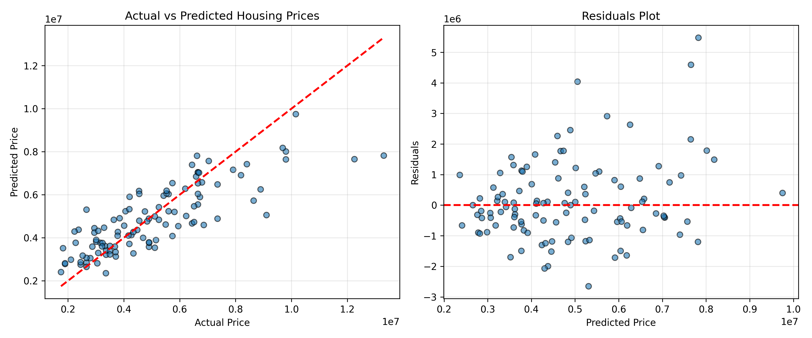
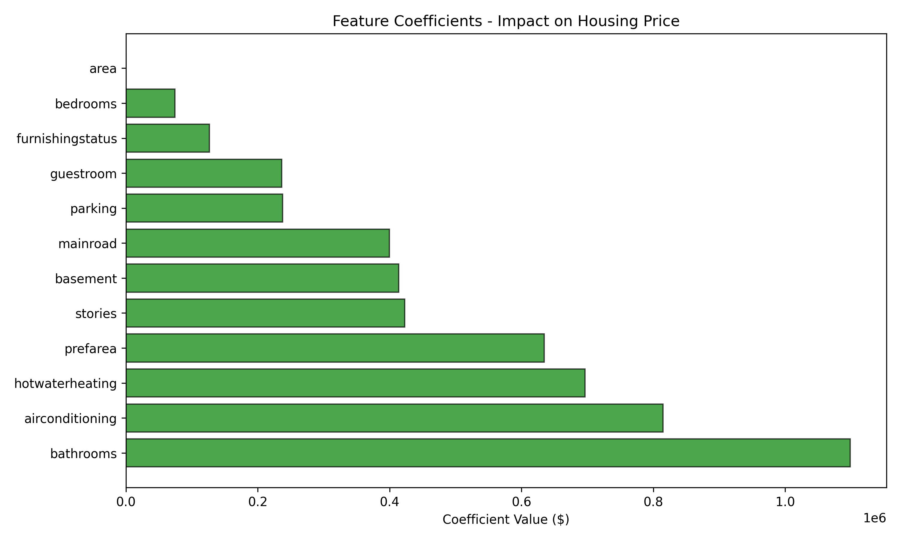

# Linear Regression
The note book here a simple demonstration about LinearRegressor Model
this model is trained and tested on a house prediction dataset Source - [https://www.kaggle.com/datasets/harishkumardatalab/housing-price-prediction]

The model shows the following evalution
1. RMSE: 1747758260816.2134
2. R2 Score: 0.6542221839581839
3. MAE: 956660.380038148

## The graph shows the Predicted and Actual values

## The graph shows Features Co-Efficient values

